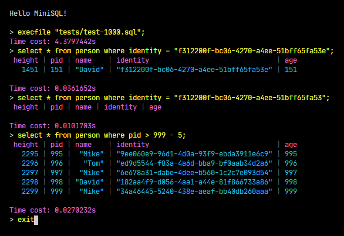
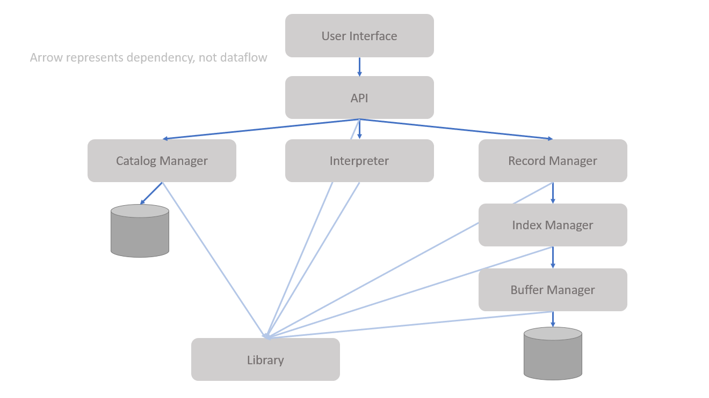

# MiniSQL

A functioning database supporting a subset of SQL. Cross-platform.

## Introduction



## Run

1. Set `pwd` to `src/MiniSQL.Client/`
1. Run command `dotnet run`
1. Type in some supported SQL
1. Type `exit` to exit
    - Caution: typing `exit` is the only way to exit the process!

## Environment

You will need .NET Core SDK to build and run this code.

Download link: <https://dotnet.microsoft.com/download/dotnet/5.0>.

## Supported Grammar

```sql
create table student (
    sno char(8),
    sname char(16) unique,
    sage int,
    sgender char (1),
    primary key ( sno )
);

drop table student;

create index stunameidx on student ( sname );

drop index stunameidx;

select * from student;
select * from student where sno = '88888888';
select * from student where sage > 20 and sgender = 'F';
select * from student where sno = '88888888' or sage > 20 and sgender = 'F';
select * from student where sage > (20 + 2) / 3;

insert into student values ('12345678','wy',22,'M');

delete from student;
delete from student where sno = '88888888';

execfile "PATH/TO/SQL_FILE" ;

-- ensure writing back all dirty pages
exit

-- write all pages back to disk
flush

use database DATABASE_NAME
drop database DATABASE_NAME

show tables;
```

## Terminology

- file := the database file
- file header := the header in the database file
- table tree := the B+ tree designed to represent a table
- index tree := the B+ tree designed to represent an index

## Spec

### Database File Format

The database file format mimicked that of SQLite but with some differences. 

Differences:

- the file headers omits many fields.
- Index tree is also implemented with B+ tree, not B tree.
- Index tree utilizes `InternalTableCell` and `LeafTableCell` rather than `InternalIndexCell` and `LeafIndexCell`. In order words, index trees have the same architecture as table trees. 
- Index tree could only support dropping and inserting along with the table tree but not deleting due to complicity (implemented in `DatabaseController`).
- The `key` field of the table cells is implemented with type `DBRecord`, not `int`.
- The nodes of B+ Tree each has a pointer `ParentPage` pointing to its parent.
- Leaf nodes of B+ Tree each has a pointer `RightPage` pointing to next leaf node on the right.

Learn more from:

- with graph - <http://chi.cs.uchicago.edu/chidb/fileformat.html>
- official - <https://www.sqlite.org/fileformat.html>

### 数据类型

只要求支持三种基本数据类型：int，char(n)，float。

### 表定义

一个表最多可以定义32个属性，各属性可以指定是否为unique；支持单属性的主键定义。

### 索引的建立和删除

对于表的主属性自动建立B+树索引，对于声明为unique的属性可以通过SQL语句由用户指定建立/删除B+树索引（因此，所有的B+树索引都是单属性单值的）。

### 查找记录

可以通过指定用and连接的多个条件进行查询，支持等值查询和区间查询。

### 插入和删除记录

支持每次一条记录的插入操作；支持每次一条或多条记录的删除操作。

## Architecture



### Client

Client 模块直接与用户交互，主要实现以下功能：

1. 程序流程控制，即“启动并初始化 -> ‘接收命令、处理命令、显示命令结果’循环 -> 退出”流程。

### Interpreter

1. 接收并解释用户输入的命令，生成命令的内部数据结构表示，同时检查命令的语法正确性和语义正确性，对正确的命令调用API层提供的函数执行并显示执行结果，对不正确的命令显示错误信息。

### API

API模块是整个系统的核心，其主要功能为提供执行SQL语句的接口，供Interpreter层调用。该接口以Interpreter层解释生成的命令内部表示为输入，根据Catalog Manager提供的信息确定执行规则，并调用Record Manager、Index Manager和Catalog Manager提供的相应接口进行执行，最后返回执行结果给Interpreter模块。

### Catalog Manager

Catalog Manager负责管理数据库的所有模式信息，包括：

1.	数据库中所有表的定义信息，包括表的名称、表中字段（列）数、主键、定义在该表上的索引。
2.	表中每个字段的定义信息，包括字段类型、是否唯一等。
3.	数据库中所有索引的定义，包括所属表、索引建立在那个字段上等。

Catalog Manager还必需提供访问及操作上述信息的接口，供Interpreter和API模块使用。

### Record Manager

Record Manager负责管理记录表中数据的数据文件。主要功能为实现数据文件的创建与删除（由表的定义与删除引起）、记录的插入、删除与查找操作，并对外提供相应的接口。其中记录的查找操作要求能够支持不带条件的查找和带一个条件的查找（包括等值查找、不等值查找和区间查找）。

数据文件由一个或多个数据块组成，块大小应与缓冲区块大小相同。一个块中包含一条至多条记录，为简单起见，只要求支持定长记录的存储，且不要求支持记录的跨块存储。

### Index Manager

Index Manager负责B+树索引的实现，实现B+树的创建和删除（由索引的定义与删除引起）、等值查找、插入键值、删除键值等操作，并对外提供相应的接口。

B+树中节点大小应与缓冲区的块大小相同，B+树的叉数由节点大小与索引键大小计算得到。

### Buffer Manager

Buffer Manager负责缓冲区的管理，主要功能有：

1.	根据需要，读取指定的数据到系统缓冲区或将缓冲区中的数据写出到文件
2.	实现缓冲区的替换算法，当缓冲区满时选择合适的页进行替换
3.	记录缓冲区中各页的状态，如是否被修改过等
4.	提供缓冲区页的pin功能，及锁定缓冲区的页，不允许替换出去

为提高磁盘I/O操作的效率，缓冲区与文件系统交互的单位是块，块的大小应为文件系统与磁盘交互单位的整数倍，一般可定为4KB或8KB。

### DB Files

DB Files指构成数据库的所有数据文件，主要由记录数据文件、索引数据文件和Catalog数据文件组成。

## Build Project

1. Set `pwd` to the project folder.
1. Make sure to uncomment the line in file `*.csproj`:
    ```csharp
    <!-- <OutputType>Exe</OutputType> -->
    ```
1. Run `dotnet run`

## TODO

- [x] Support `create database <DATABASE_NAME>`
- [x] Support `drop database <DATABASE_NAME>`
- [ ] Show number of rows that is modified
